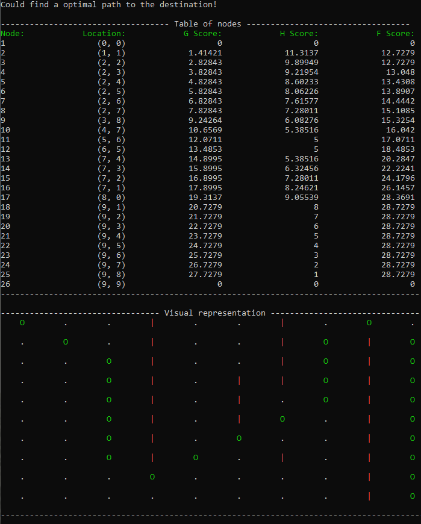

# A-star

This repository contains an implementation of the A* (A-star) algorithm in C++. The A* algorithm is a widely used pathfinding algorithm that combines the best features of Dijkstra's algorithm and greedy best-first search to find the shortest path between two nodes in a graph.

## Example Run

To demonstrate the usage of the A* algorithm implementation, here's an example run:

1. The used maze was the following:
```cpp
#define ROW 10
#define COL 10
 
int maze[ROW][COL] =
{
  {0, 0, 0, 1, 0, 0, 1, 0, 0, 0},
  {0, 0, 0, 1, 0, 0, 1, 0, 1, 0},
  {0, 0, 0, 1, 0, 0, 1, 0, 1, 0},
  {0, 0, 0, 1, 0, 1, 1, 0, 1, 0},
  {0, 0, 0, 1, 0, 1, 0, 0, 1, 0},
  {0, 0, 0, 1, 0, 1, 0, 0, 1, 0},
  {0, 0, 0, 1, 0, 0, 0, 0, 1, 0},
  {0, 0, 0, 1, 0, 0, 1, 0, 1, 0},
  {0, 0, 0, 0, 0, 0, 0, 0, 1, 0},
  {0, 0, 0, 0, 0, 0, 0, 0, 1, 0}
};
```

2. And the run with this maze gave the following print-out


